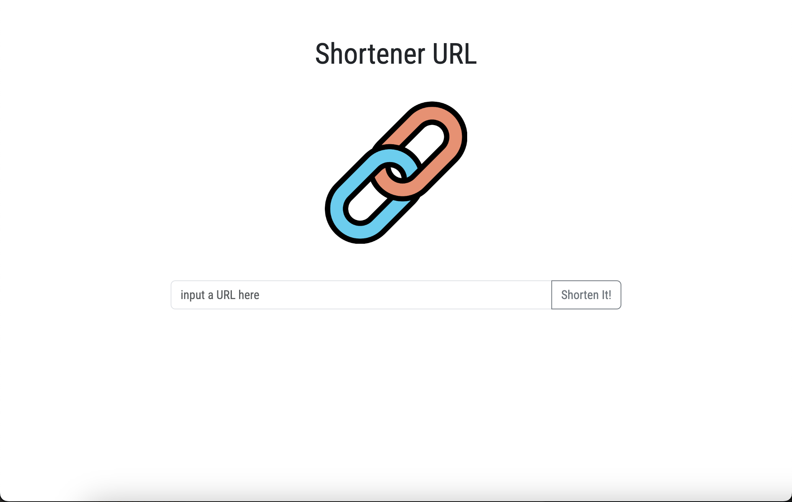
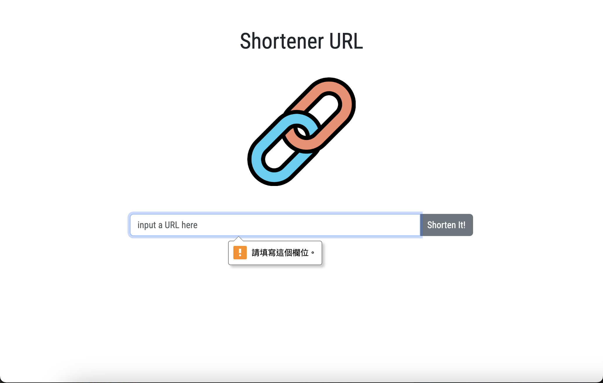
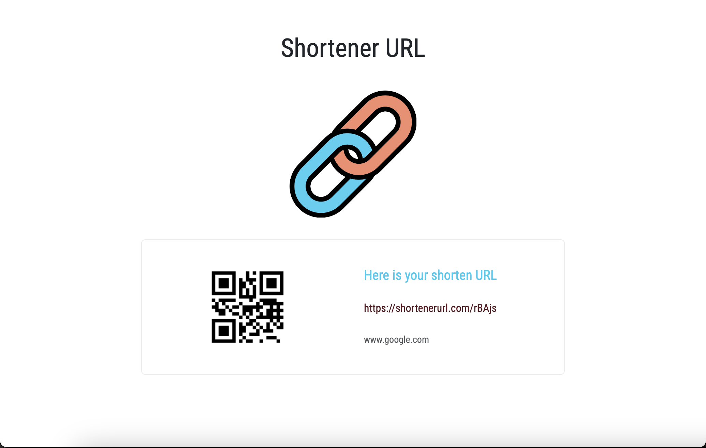

# ALPHA Camp - The shorten URL project

This is a exercise to set up a express server and use express-handlebars to render the page.
The user can input a URL, and get a shorten URL and QR code.

- Screenshot:
  
  
  

## Table of contents

- [Features](#features)
- [Built with](#built-with)
- [Installation and execution](#installation-and-execution)
- [Author](#author)
- [Acknowledgments](#acknowledgments)

## Features

Users should be able to:

- Create a shortener URL
- Create a QR code image

## Built with

- node.js
- express.js
- express-handlebars
- qr-image
- Bootstrap

## Installation and execution

- Clone the project

```Shell
git clone https://github.com/YAcodingroom/shortenURL.git
```

- Initialize NPM

```Shell
npm init -y
```

- Install express & express-handlebars & qr-image

```Shell
npm install express qr-image express-handlebars
```

- Install nodemon

```Shell
npm install -g nodemon
```

- Run the app.js

```Shell
npm run dev
```

## Author

- ALPHA Camp
- YAL

## Acknowledgments

- ALPHA Camp
- Dr. Angela
- stackoverflow
- goole :D
